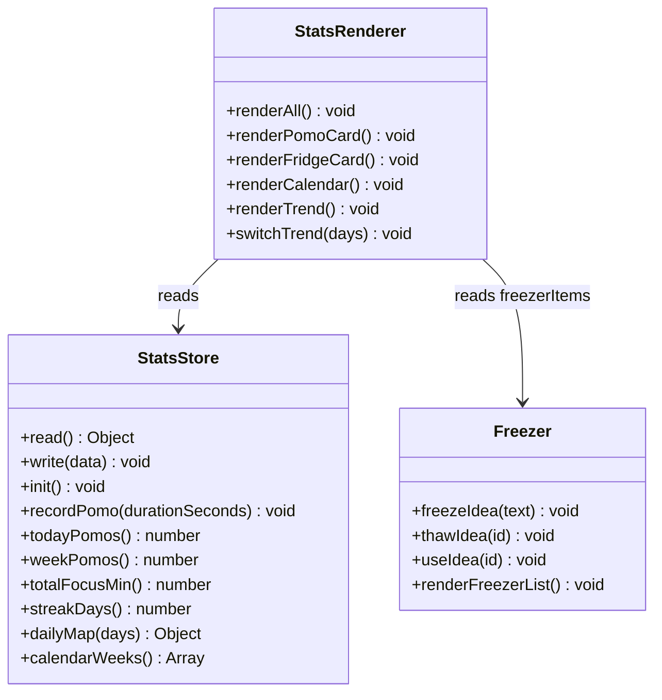
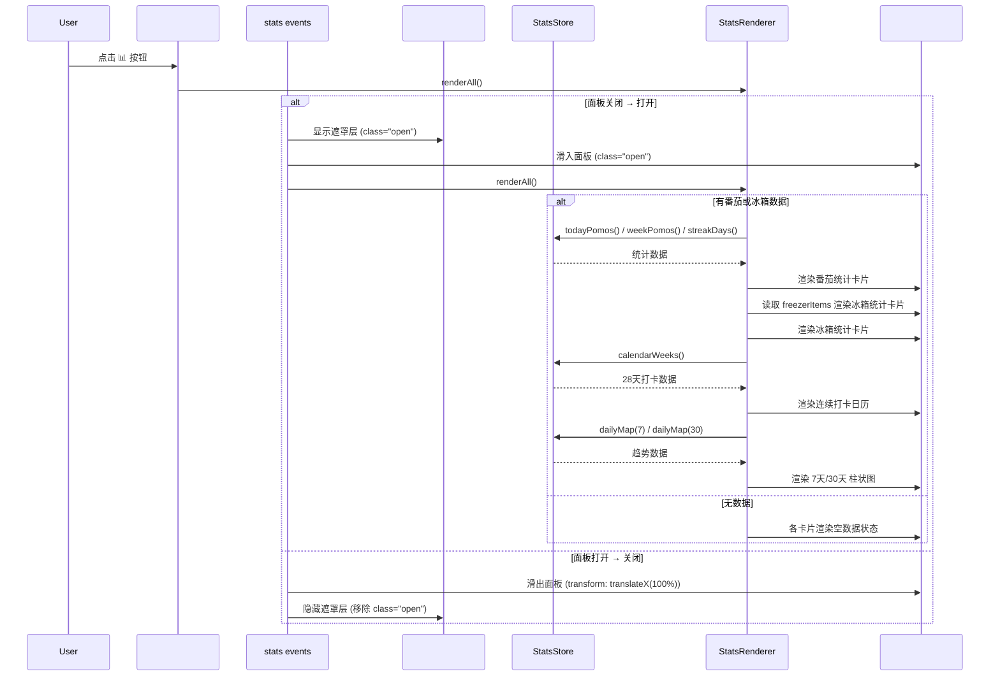
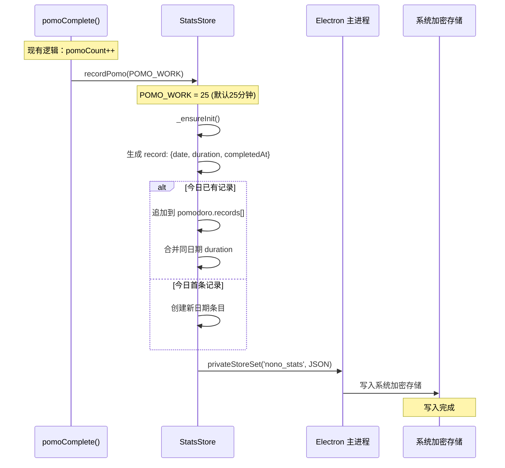
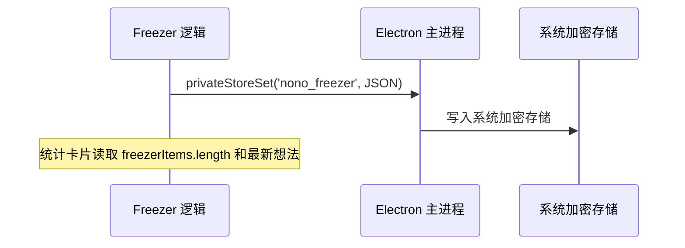
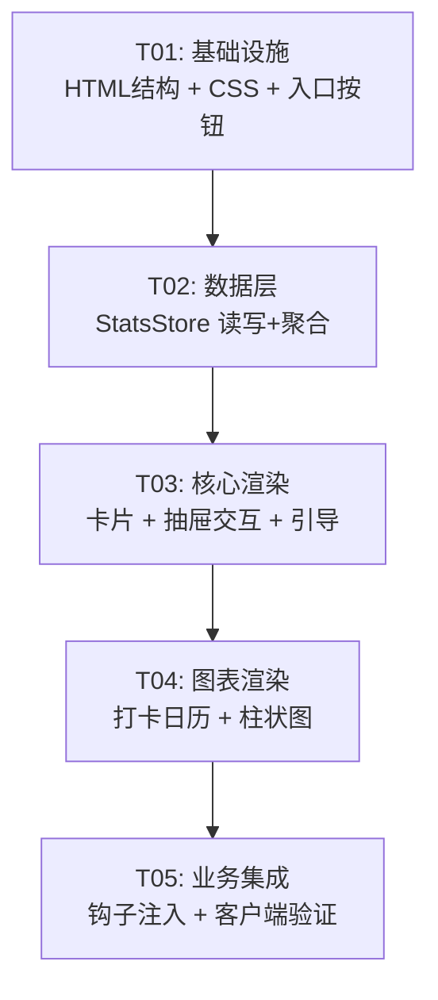

# 数据统计面板 — 系统架构设计

> **Architect**: Bob  
> **Date**: 2025-05-21  
> **Project**: 孬孬 (naonao) ADHD 陪伴宠物  
> **Feature**: 数据统计面板

---

## Part A: 系统设计

### 1. 实现方案

#### 1.1 核心技术挑战

| 挑战 | 说明 |
|------|------|
| **纯 CSS/SVG 图表** | 不引入 Chart.js 等第三方库，用 div+CSS 实现柱状图、CSS Grid 实现打卡日历 |
| **客户端入口** | 只维护 Electron 客户端入口 `app/index.html`；`naonao.help` 只作为介绍和下载页 |
| **数据钩子注入** | 在现有 `pomoComplete()` 函数中插入统计写入逻辑，最小化侵入性 |
| **右侧抽屉** | 现有系统只有底部 Sheet（设置面板），需从零构建右侧滑出 Drawer |
| **首次引导** | 统计面板空数据时需引导文案，与现有 onboarding 系统协调 |

#### 1.2 架构模式

```
┌─────────────────────────────────────────────────────┐
│                 app/index.html                       │
│  ┌─────────────┐  ┌──────────┐  ┌───────────────┐  │
│  │ StatsToggle  │  │ Overlay  │  │ StatsDrawer   │  │
│  │ (#stats-     │  │(#stats-  │  │ (#stats-drawer)│  │
│  │  -btns 内)   │  │ overlay) │  │  右侧滑出     │  │
│  └──────┬──────┘  └────┬─────┘  └───────┬───────┘  │
│         │              │                │           │
│         └──────────────┴────────────────┘           │
│                        │                            │
│               ┌────────▼────────┐                   │
│               │   StatsStore    │                   │
│               │  (数据读写层)    │                   │
│               └────────┬────────┘                   │
│                        │                            │
│               ┌────────▼────────┐                   │
│               │  private store  │                   │
│               │ nono_stats      │                   │
│               └─────────────────┘                   │
│                                                     │
│  数据写入钩子:                                       │
│  ┌──────────────┐    ┌──────────────────────┐       │
│  │ pomoComplete │───▶│ StatsStore.recordPomo│       │
│  │ () 现有函数   │    │ (duration)           │       │
│  └──────────────┘    └──────────────────────┘       │
│                                                     │
│  ┌──────────────┐    ┌───────────────────────┐      │
│  │  Freezer     │───▶│ privateStore nono_freezer│      │
│  │  current UI  │    │  (current item list)    │      │
│  └──────────────┘    └───────────────────────┘      │
└─────────────────────────────────────────────────────┘
```

#### 1.3 框架选型

**确认：零外部依赖、纯 HTML/CSS/JS。**

| 层面 | 技术选择 | 理由 |
|------|----------|------|
| 渲染 | 纯 DOM API | 与现有代码风格一致（无框架） |
| 图表 | CSS div 柱状 + CSS Grid 日历 | 零依赖，轻量，足够表达趋势 |
| 动画 | CSS transition + animation | 与现有 drawer/sheet 动画一致 |
| 存储 | Electron 私密存储，键名 `nono_stats` | 与现有 `nono_*` key 命名保持一致，落盘经系统加密存储 |
| 样式 | CSS 自定义属性（复用 `:root` 变量） | 与现有设计系统无缝集成 |

---

### 2. 文件列表

```
naonao/
├── app/
│   ├── index.html          ← [修改] Electron 客户端 HTML 结构
│   ├── app.js              ← [修改] Electron 客户端业务逻辑
│   └── styles.css          ← [修改] Electron 客户端样式
└── docs/
    ├── system_design.md    ← [新建] 本文件
    ├── class-diagram.mermaid    ← [新建] 类图
    └── sequence-diagram.mermaid ← [新建] 时序图
```

> **注意**：这是客户端-only 项目。后续统计面板维护只改 `app/index.html`、`app/app.js`、`app/styles.css`；`naonao.help` 只放介绍和下载链接，不承载产品功能。

---

### 3. 数据结构和接口

#### 3.1 数据模型（私密存储 `nono_stats`）

```json
{
  "version": 1,
  "pomodoro": {
    "records": [
      { "date": "2025-05-21", "duration": 25, "completedAt": "2025-05-21T10:30:00.000Z" }
    ]
  },
  "fridge": {
    "frozen": 0,
    "retrieved": 0,
    "records": [
      { "action": "freeze", "ideaId": "abc123", "timestamp": "2025-05-21T09:00:00.000Z" }
    ]
  }
}
```

#### 3.2 核心 API — `StatsStore`


```mermaid
classDiagram
    class StatsStore {
        +read() Object
        +write(data) void
        +init() void
        +recordPomo(durationSeconds) void
        +todayPomos() number
        +weekPomos() number
        +totalFocusMin() number
        +streakDays() number
        +dailyMap(days) Object
        +calendarWeeks() Array
    }

    class StatsRenderer {
        +renderAll() void
        +renderPomoCard() void
        +renderFridgeCard() void
        +renderCalendar() void
        +renderTrend() void
        +switchTrend(days) void
    }

    class Freezer {
        +freezeIdea(text) void
        +thawIdea(id) void
        +useIdea(id) void
        +renderFreezerList() void
    }

    StatsRenderer --> StatsStore : reads
    StatsRenderer --> Freezer : reads freezerItems
```

#### 3.3 核心函数签名（JavaScript）

```javascript
// ===== StatsStore — 数据层 =====
const StatsStore = {
  // 初始化：从 privateGet('nono_stats') 读取或创建空数据结构
  init() { /* 返回 void */ },

  // 记录一次番茄完成（在 pomoComplete 中调用）
  // @param {number} durationSeconds - 本次番茄时长（秒）
  recordPomo(durationSeconds) { /* 返回 void */ },

  // ── 聚合查询 ──
  totalFocusMin()           → number           // 累计专注分钟数
  todayPomos()              → number           // 今日番茄数
  weekPomos()               → number           // 本周番茄数
  streakDays()              → number           // 连续打卡天数（≥1个番茄=打卡）
  // 冰箱统计直接读取 nono_freezer 当前列表；不再伪造历史事件 API

  // ── 趋势数据 ──
  dailyMap(days)            → Object           // 最近 N 天每日番茄数
  calendarWeeks()           → Array            // 4周日历热力图数据

  // ── 内部方法 ──
  read()                    → Object           // 从私密存储读取
  write(data)               → void             // 写入私密存储
};

// ===== StatsRenderer — 渲染层 =====
const StatsRenderer = {
  renderAll()               → void   // 完整渲染面板内容
  renderPomoCard()          → void   // 渲染番茄统计卡片
  renderFridgeCard()        → void   // 渲染冰箱统计卡片
  renderCalendar()          → void   // 渲染连续打卡日历（4周热力图）
  renderTrend()             → void   // 渲染 7/30 天柱状图
  switchTrend(days)         → void   // 切换趋势时间范围
};

// 面板控制由 #stats-toggle / #stats-overlay / #stats-close 事件直接驱动，
// 打开时调用 StatsRenderer.renderAll()。
```

---

### 4. 程序调用流程

#### 4.1 用户点击入口 → 面板展示（主流程）


```mermaid
sequenceDiagram
    participant User
    participant StatsBtn as #stats-toggle
    participant Drawer as stats events
    participant Overlay as #stats-overlay
    participant Store as StatsStore
    participant Renderer as StatsRenderer
    participant DOM as #stats-drawer

    User->>StatsBtn: 点击 📊 按钮
    StatsBtn->>Renderer: renderAll()

    alt 面板关闭 → 打开
        Drawer->>Overlay: 显示遮罩层 (class="open")
        Drawer->>DOM: 滑入面板 (class="open")
        Drawer->>Renderer: renderAll()

        alt 有番茄或冰箱数据
            Renderer->>Store: todayPomos() / weekPomos() / streakDays()
            Store-->>Renderer: 统计数据
            Renderer->>DOM: 渲染番茄统计卡片
            Renderer->>DOM: 读取 freezerItems 渲染冰箱统计卡片
            Renderer->>DOM: 渲染冰箱统计卡片
            Renderer->>Store: calendarWeeks()
            Store-->>Renderer: 28天打卡数据
            Renderer->>DOM: 渲染连续打卡日历
            Renderer->>Store: dailyMap(7) / dailyMap(30)
            Store-->>Renderer: 趋势数据
            Renderer->>DOM: 渲染 7天/30天 柱状图
        else 无数据
            Renderer->>DOM: 各卡片渲染空数据状态
        end
    else 面板打开 → 关闭
        Drawer->>DOM: 滑出面板 (transform: translateX(100%))
        Drawer->>Overlay: 隐藏遮罩层 (移除 class="open")
    end
```

#### 4.2 番茄完成 → 数据写入（钩子流程）


```mermaid
sequenceDiagram
    participant Timer as pomoComplete()
    participant Store as StatsStore
    participant Main as Electron 主进程
    participant Safe as 系统加密存储

    Note over Timer: 现有逻辑：pomoCount++

    Timer->>Store: recordPomo(POMO_WORK)
    Note over Store: POMO_WORK = 25 (默认25分钟)

    Store->>Store: _ensureInit()
    Store->>Store: 生成 record: {date, duration, completedAt}

    alt 今日已有记录
        Store->>Store: 追加到 pomodoro.records[]
        Store->>Store: 合并同日期 duration
    else 今日首条记录
        Store->>Store: 创建新日期条目
    end

    Store->>Main: privateStoreSet('nono_stats', JSON)
    Main->>Safe: 写入系统加密存储
    Note over Safe: 写入完成
```

#### 4.3 冰箱操作 → 当前列表写入


```mermaid
sequenceDiagram
    participant Freezer as Freezer 逻辑
    participant Main as Electron 主进程
    participant Safe as 系统加密存储

    Freezer->>Main: privateStoreSet('nono_freezer', JSON)
    Main->>Safe: 写入系统加密存储
    Note over Freezer: 统计卡片读取 freezerItems.length 和最新想法
```

---

### 5. 待明确事项

| # | 问题 | 假设 | 影响 |
|---|------|------|------|
| 1 | **冰箱功能是否已实现？** 当前客户端已实现想法冰箱，私密存储键为 `nono_freezer` | 统计面板读取当前冰箱列表，不记录冷冻/取用历史事件 | 若未来需要历史趋势，需要新增事件表 |
| 2 | **BodyDoubling 统计是否纳入？** | 根据 Q7 回答：**暂不纳入**。统计面板只关注番茄 + 冰箱 | BodyDoubling 数据不写入 `nono_stats` |
| 3 | **抽屉遮罩是否复用现有 `#s-overlay`？** 现有 overlay 绑定到设置面板 | **新建独立 `#stats-overlay`**，避免与设置面板事件冲突 | 两个 overlay 不会同时出现，但独立管理更安全 |
| 4 | **POMO_WORK 时长可变吗？** 用户可在设置中调整番茄时长 | `recordPomo(durationSeconds)` 接受动态时长参数 | 若时长固定 25 分钟，硬编码即可 |

---

## Part B: 任务分解

### 6. 所需包/依赖

```
无外部依赖。纯 HTML/CSS/JS，零 package 变更。
```

### 7. 任务列表

| 任务 ID | 任务名称 | 涉及文件 | 依赖 | 优先级 |
|---------|----------|----------|------|--------|
| **T01** | 项目基础设施：HTML 结构 + CSS 变量 + 入口按钮 | `app/index.html`, `app/styles.css` | 无 | P0 |
| **T02** | 数据层：StatsStore 读写 + 聚合计算函数 | `app/app.js` | T01 | P0 |
| **T03** | 核心渲染：统计卡片 + 抽屉交互 + 空数据引导 | `app/app.js`, `app/styles.css` | T02 | P0 |
| **T04** | 图表渲染：打卡日历 + 7天/30天柱状图 | `app/app.js`, `app/styles.css` | T03 | P1 |
| **T05** | 业务集成：番茄钩子 + 冰箱当前列表统计 + 客户端验证 | `app/app.js` | T04 | P0 |

#### T01 详情：项目基础设施（P0）

**目标**：在 Electron 客户端中建立统计面板的 HTML 骨架、CSS 样式系统、入口按钮。

**具体工作**：
1. 在 `:root` 中新增统计面板专用 CSS 变量（卡片色、图表色、日历色等）
2. 在 `</body>` 前新增 HTML 结构：
   - `#stats-overlay` — 遮罩层（与 `#s-overlay` 风格一致）
   - `#stats-drawer` — 右侧抽屉容器（宽 380px）
     - `#stats-head` — 标题栏（"📊 数据统计" + 关闭按钮）
     - `#stats-body` — 内容区（滚动容器）
       - `#stats-pomo-card` — 番茄统计卡片
       - `#stats-fridge-card` — 冰箱统计卡片
       - `#stats-cal` — 打卡日历区
       - `#stats-trend` — 番茄趋势柱状图区
3. 使用 `#stats-toggle` 作为入口按钮（📊）
4. 新增抽屉滑入/滑出 CSS 动画（transform + transition，与设置面板风格统一）
5. 响应式：移动端全宽、桌面端 380px

**关键 CSS 设计方向**：
- 抽屉背景 `var(--sheet-bg)`，左侧圆角 20px
- 卡片使用 `background: rgba(255,253,255,.78)` + `border: 1.5px solid var(--card-bd)`
- 卡片圆角 16px，内边距 16px
- 数字用大号 `var(--font-display)` 展示
- 标签用小号 `font-size: 11px; color: var(--text-dim); letter-spacing: .06em` 大写
- 柱状图：div 底部对齐，`background: linear-gradient(to top, var(--accent), var(--focus))`，圆角顶
- 日历格子：`width: 32px; height: 32px`，圆角 6px，打卡日填充 `var(--focus)`，未打卡 `#f0ebff`

#### T02 详情：数据层 StatsStore（P0）

**目标**：实现 `StatsStore` 对象，包含完整的 CRUD + 聚合计算。

**具体工作**：
1. `init()` — 页面加载时调用，从 `privateGet('nono_stats')` 读取
2. `recordPomo(durationSeconds)` — 写入番茄记录
3. 冰箱卡片读取 `nono_freezer` 当前列表；历史冷冻/取用事件尚未实现
4. 聚合查询函数（见 3.3 节签名）
5. `streakDays()` — 从今天往前数连续打卡天数（≥1个番茄即打卡）
6. `dailyMap(days)` — 返回最近 N 天日期到番茄数的映射，缺失日期 count=0
7. `calendarWeeks()` — 返回最近 4 周数据，用于热力图
8. 边界处理：`init()` 确保 JSON 结构完整（兼容旧版本无此 key 的情况）

**待确认**：周起始为周一（Q8），打卡门槛为 1 个番茄（Q9）。

#### T03 详情：核心渲染 + 抽屉交互（P0）

**目标**：实现面板的打开/关闭交互、统计卡片渲染、空数据引导。

**具体工作**：
1. `#stats-toggle` / `#stats-overlay` / `#stats-close` 事件控制 `#stats-drawer` 和遮罩状态
2. 点击 overlay 关闭、点击关闭按钮关闭、ESC 键关闭
3. `StatsRenderer.renderAll()` — 主渲染入口，判断数据后调用卡片/图表渲染
4. 空数据引导在各卡片内分别渲染，避免额外全局状态
5. `StatsRenderer.renderPomoCard(data)` — 渲染番茄卡片：
   - 主数字：累计番茄总数
   - 副指标：今日番茄、连续打卡天数
   - 微型进度条
6. `StatsRenderer.renderFridgeCard(data)` — 渲染冰箱卡片：
   - 冷冻总数 / 取用总数
   - 若有数据则显示比率，无数据则显示「冰箱还没用过呢～」

#### T04 详情：图表渲染（P1）

**目标**：用纯 CSS 实现打卡日历热力图和趋势柱状图。

**具体工作**：
1. 打卡日历（`#stats-cal`）：
   - CSS Grid 7 列 × 4 行（28 天）
   - 每格 32×32px，圆角 6px
   - 有打卡：`background: var(--stats-heat-on, #7c5cbf)`
   - 无打卡：`background: var(--stats-heat-off, #f0ebff)`
   - 今日：额外边框高亮 `border: 2px solid var(--accent)`
   - 每格 title 属性显示日期和番茄数
   - 左侧显示周标签（一/二/三/四/五/六/日）
2. 7天柱状图（`#stats-trend`）：
   - 7 根柱子 + 底部日期标签
   - 使用 flexbox + div，每根柱子 `width: 32px`
   - 高度 = `(count / maxCount) * 120px`（最高 120px）
   - 渐变背景 `linear-gradient(to top, #c8b5f5, #7c5cbf)`
   - 顶部显示番茄数
   - 可切换 30 天视图
3. 7天/30天切换 Tab（pill 风格 segment control，复用现有 `.seg` / `.seg-b` 样式）

**图表 CSS 关键点**：
```css
.stats-bar {
  width: 32px;
  border-radius: 6px 6px 0 0;
  background: linear-gradient(to top, var(--accent), var(--focus));
  transition: height .4s cubic-bezier(.34,1.4,.64,1);
  align-self: flex-end;
}
```

#### T05 详情：业务集成 + 客户端验证（P0）

**目标**：将统计写入钩子注入现有业务逻辑，完成客户端端到端验证。

**具体工作**：
1. **番茄钩子**：在 `app/app.js` 的 `pomoComplete()` 函数中，`pomoCount++` 之后插入：
   ```javascript
   StatsStore.recordPomo(POMO_WORK);
   ```
2. **冰箱统计**：统计面板读取 `freezerItems.length` 和最新条目；不记录历史趋势
3. **入口按钮事件**：`#stats-toggle` 打开/关闭 `#stats-drawer`
4. **初始化**：在页面 JS 初始化阶段调用 `StatsStore.init()`
5. **首次引导联动**：无番茄/冰箱数据时，各卡片显示空数据引导
6. **客户端验证**：只测试 `app/index.html` 入口和 Electron smoke；`naonao.help` 只验证下载链接和介绍页内容
7. **边界测试**：
   - 无私密存储数据时首次打开
   - 番茄完成后立即打开面板验证数据
   - 跨日期打卡连续性
   - 抽屉打开时切换番茄状态不闪退

---

### 8. 共享知识

```
【设计系统约定】
- 所有 CSS 复用 :root 变量，新变量以 --stats- 为前缀
- 按钮风格统一使用现有 .pill-btn / .icon-btn 模式（见 app/index.html L831-863）
- 抽屉动画使用 CSS transition（transform + opacity），duration 约 .3-.38s
- 字体：数字用 var(--font-display)（Fraunces），标签用 var(--font-body)（Nunito）

【数据约定】
- 私密存储键名：nono_stats
- 日期格式：YYYY-MM-DD（与现有 zt_lastActivity 等时间戳格式不同，这里用日期字符串）
- 时间戳格式：ISO 8601 UTC
- version 字段用于未来数据迁移

【客户端-only 维护约定】
- 产品入口：app/index.html
- 业务逻辑：app/app.js
- 样式：app/styles.css
- `naonao.help` / GitHub Pages 只作为介绍和下载页，不实现网页端
- CSS 变量定义放在 app/styles.css 的现有变量块末尾
- HTML 结构放在 app/index.html 的对应面板区域
- JS 代码放在 app/app.js 的对应功能区

【命名约定】
- CSS ID 以 stats- 为前缀（#stats-overlay, #stats-drawer, #stats-toggle ...）
- JS 全局对象：StatsStore, StatsRenderer
- CSS 类以 .stats- 为前缀

【冰箱功能状态】
- 当前代码库中已实现冰箱功能，私密存储数据键为 nono_freezer
- 统计面板的冰箱卡片读取当前冰箱列表，需继续做"数据为空"处理
- 旧设计里的 recordFridge() 接口未落地；如需冷冻/取用历史统计，应另行实现历史事件表
- 冰箱卡片无数据时显示温和占位文案

【隐私与性能】
- 用户内容数据存储在本机系统加密存储，不上传
- 统计数据写入在 pomoComplete 中通过 renderer cache 即时生效，并异步落盘到私密存储
- 面板渲染仅在打开时触发，无后台轮询
```

---

### 9. 任务依赖图


```mermaid
graph TD
    T01["T01: 基础设施<br/>HTML结构 + CSS + 入口按钮"]
    T02["T02: 数据层<br/>StatsStore 读写+聚合"]
    T03["T03: 核心渲染<br/>卡片 + 抽屉交互 + 引导"]
    T04["T04: 图表渲染<br/>打卡日历 + 柱状图"]
    T05["T05: 业务集成<br/>钩子注入 + 客户端验证"]

    T01 --> T02
    T02 --> T03
    T03 --> T04
    T04 --> T05
```

> **线性依赖**：T01→T02→T03→T04→T05。每个任务依赖前一个的基础设施/数据/渲染结果。这是有意为之，因为统计面板的内部耦合度较高，线性拆分是最清晰的方式。

---

## 附录：CSS 设计参考

### A1. 抽屉 CSS 骨架

```css
/* ── Stats Overlay ── */
#stats-overlay {
  position: fixed; inset: 0; background: var(--overlay-bg); z-index: 110;
  opacity: 0; pointer-events: none;
  transition: opacity .28s;
  backdrop-filter: blur(4px); -webkit-backdrop-filter: blur(4px);
}
#stats-overlay.open { opacity: 1; pointer-events: all; }

/* ── Stats Drawer Panel ── */
#stats-drawer {
  position: fixed; top: 0; right: 0; bottom: 0;
  width: 380px; max-width: 92vw;
  background: var(--sheet-bg);
  border-radius: 20px 0 0 20px;
  box-shadow: -6px 0 32px rgba(100,70,180,.14);
  z-index: 111;
  transform: translateX(105%);
  transition: transform .36s cubic-bezier(.3,1.1,.55,1);
  display: flex; flex-direction: column;
  overflow: hidden;
}
#stats-drawer.open { transform: translateX(0); }

.stats-header {
  display: flex; align-items: center; justify-content: space-between;
  padding: 18px 20px 12px;
  border-bottom: 1px solid var(--hairline);
  flex-shrink: 0;
}
.stats-title {
  font-family: var(--font-display);
  font-size: 18px; font-weight: 600;
  color: var(--text-main);
  display: flex; align-items: center; gap: 8px;
}

.stats-body {
  flex: 1; overflow-y: auto; -webkit-overflow-scrolling: touch;
  padding: 16px;
  display: flex; flex-direction: column; gap: 14px;
}

/* ── Stats Card ── */
.stat-card {
  background: var(--card-bg);
  border: 1.5px solid var(--card-bd);
  border-radius: 16px; padding: 16px;
}
.stat-big {
  font-family: var(--font-display);
  font-size: 36px; font-weight: 700;
  color: var(--text-main); line-height: 1;
}
.stat-label {
  font-size: 11px; font-weight: 800;
  color: var(--text-dim);
  letter-spacing: .06em; text-transform: uppercase;
  margin-top: 4px;
}
.stat-row {
  display: flex; gap: 16px; margin-top: 10px;
  font-size: 12px; color: var(--text-dim);
}

/* ── Calendar Heatmap ── */
.cal-grid {
  display: grid;
  grid-template-columns: repeat(7, 1fr);
  gap: 4px;
}
.cal-cell {
  aspect-ratio: 1;
  border-radius: 6px;
  background: #f0ebff;
  font-size: 10px; font-weight: 700;
  display: flex; align-items: center; justify-content: center;
  color: var(--text-dim);
}
.cal-done {
  background: var(--focus);
  color: #fff;
}
.cal-today {
  box-shadow: 0 0 0 2px var(--accent);
}

/* ── Bar Chart ── */
.trend-bars {
  display: flex; align-items: flex-end; gap: 6px;
  height: 140px;
  padding: 0 4px;
}
.trend-bar-wrap {
  display: flex; flex-direction: column; align-items: center;
  flex: 1; height: 100%; justify-content: flex-end;
}
.stats-bar {
  width: 100%; max-width: 32px;
  border-radius: 6px 6px 0 0;
  background: linear-gradient(to top, var(--accent), var(--focus));
  transition: height .4s cubic-bezier(.34,1.4,.64,1);
  min-height: 2px;
}
.stats-bar-label {
  font-size: 10px; font-weight: 700;
  color: var(--text-dim); margin-top: 5px;
}
```

### A2. 空数据引导设计

```
┌──────────────────────────────────┐
│                                  │
│           🐨                     │
│                                  │
│     还没有完成过番茄呢～           │
│     开始第一个专注吧 🌱           │
│                                  │
│    ┌──────────────────────┐      │
│    │   🍅 开始专注         │      │
│    └──────────────────────┘      │
│                                  │
└──────────────────────────────────┘
```

- 居中布局，考拉插画 + 温和文案
- 「开始专注」按钮联动触发番茄钟（调用 `pomoStartBtn.click()`）
- 此状态在对应统计卡片没有数据时展示
